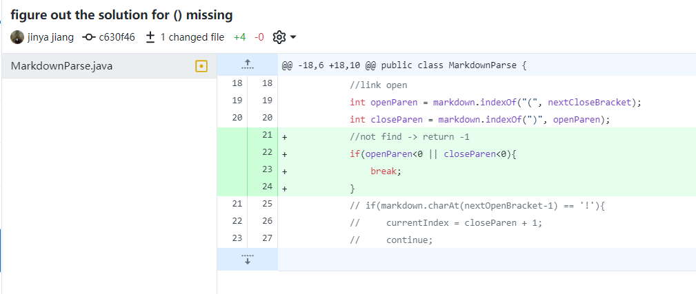

# Process of testing bugs and improve the code

## First code changes
code change difference: Now can differentiate a picture and a link

[test file 2](https://github.com/yayajjiang/markdown-parse/blob/main/test-file2.md)

output:

Relationships:

If we do not test if there is a `!` before `[]`, then an image 
will be recognized as a link, which is not what we expect(wrong output). Therefore, we need an
additional test for `!`.

## Second code changes
code change difference: The first letter of the markdown file is `[`, can still
be recognized and return the link

[test file 3](https://github.com/yayajjiang/markdown-parse/blob/main/test-file3.md)

output:

Relationships: String index out of bounds exception. If there is no #test in the above, and there
are only links in the file, then implementing the test will avoid the error.

## Third code changes

code change difference: Can eliminate the format difference without `[]`

[test file 4](https://github.com/yayajjiang/markdown-parse/blob/main/test-file4.md)

output:

Relationships:
If for some reason, the brackets are not included in the markdown file, then
they will not be shown as links also. String index out of bounds error.